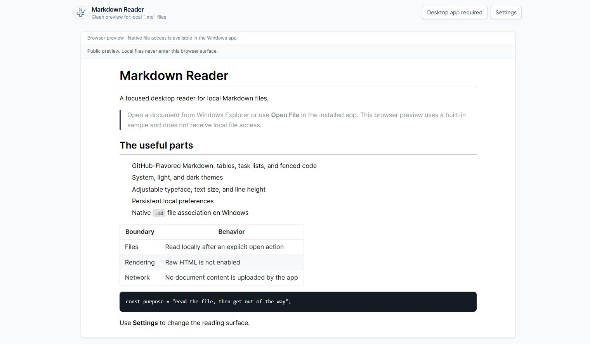
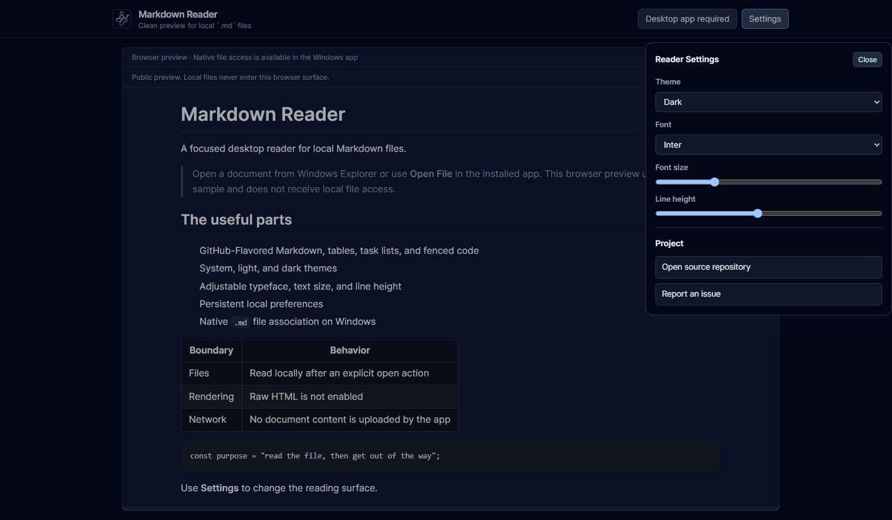

# Markdown Reader

A focused Windows desktop reader for local Markdown files. It uses Tauri 2, React 19, TypeScript, and Rust to provide a native file-open flow without turning a document viewer into a full editor.



## What it does

- Opens `.md`, `.markdown`, `.mdown`, and `.mkd` files from the app or a Windows file association.
- Renders GitHub-Flavored Markdown, including tables, task lists, and fenced code.
- Supports system, light, and dark themes.
- Lets the reader adjust typeface, font size, and line height.
- Stores reading preferences locally.
- Provides a browser-safe sample document for public review and development.



## Privacy and trust boundary

The installed app reads a local document only after the user opens it or launches the app through a Markdown file association. Document contents are rendered on-device and are not uploaded by this project. Raw HTML rendering is not enabled.

Markdown can still contain links and remote images. Treat unfamiliar documents as untrusted content: opening a link or allowing a remote image request can reveal normal request metadata to the destination. This repository does not claim to sandbox arbitrary active content, and the app is a reader rather than a security boundary.

The browser preview cannot access local files. It renders a built-in sample so the public interface can be reviewed without a native Tauri session.

## Run locally

Prerequisites:

- Node.js 20 or newer
- Rust stable
- The [Tauri 2 Windows prerequisites](https://v2.tauri.app/start/prerequisites/)

```powershell
npm ci
npm run dev
```

To run the native app:

```powershell
npm run tauri dev
```

To verify production builds:

```powershell
npm run build
cargo check --manifest-path src-tauri/Cargo.toml
```

The configured native bundle target is an NSIS installer for the current Windows user. This repository does not currently publish signed installers or promise an automatic-update channel.

## Architecture

- `src/App.tsx` — document reader, browser preview, settings, and native open flow
- `src-tauri/src/lib.rs` — canonicalizes the selected path, limits accepted extensions, and reads UTF-8 text
- `src-tauri/tauri.conf.json` — window, installer, icon, and file-association configuration
- `src-tauri/capabilities/default.json` — the native permissions required by the main window

## License

MIT. See [LICENSE](LICENSE).
